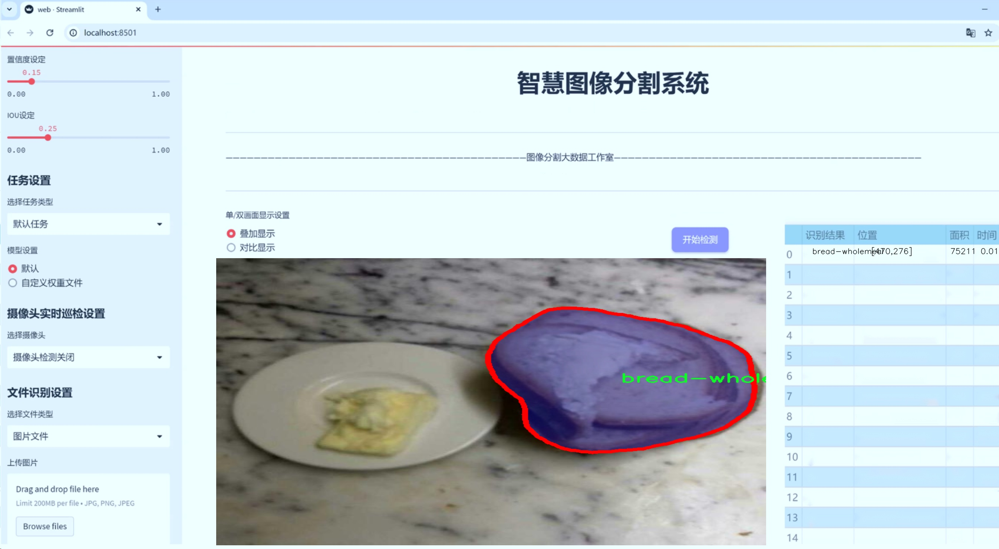
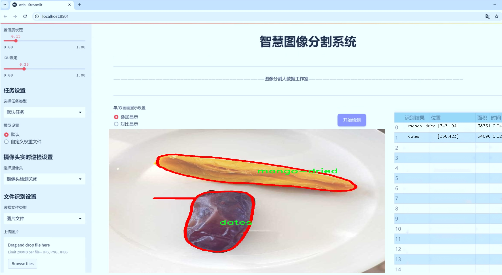
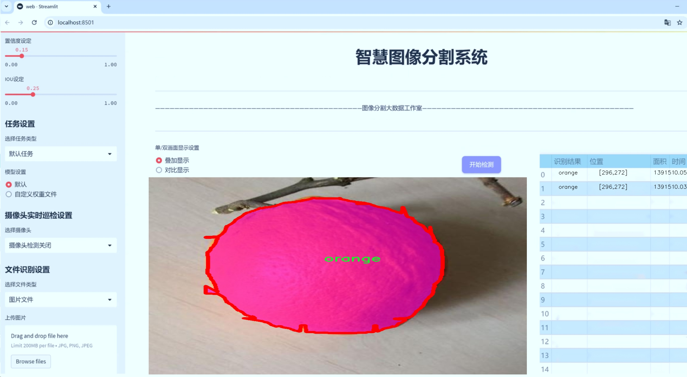
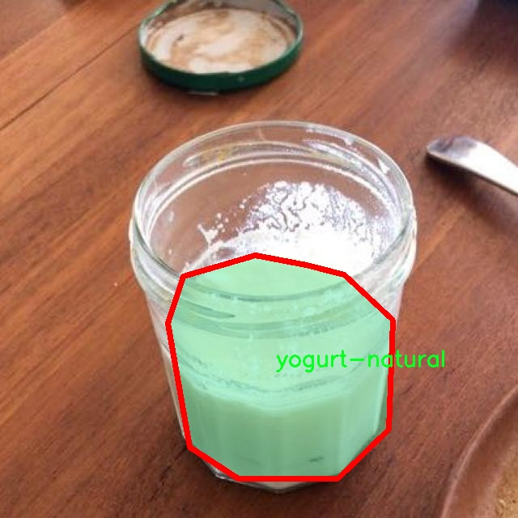
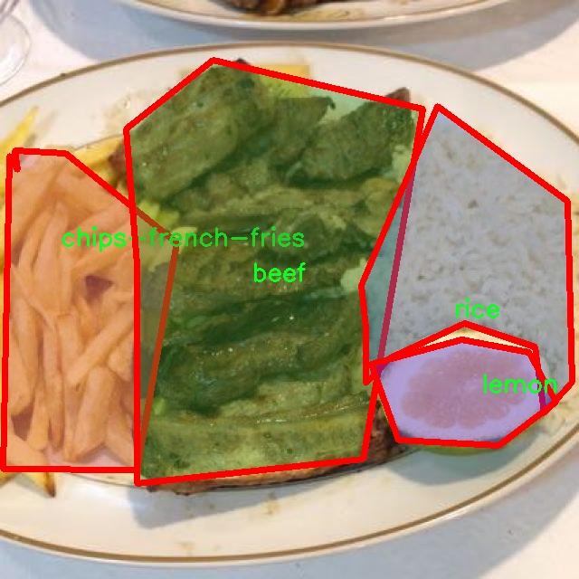
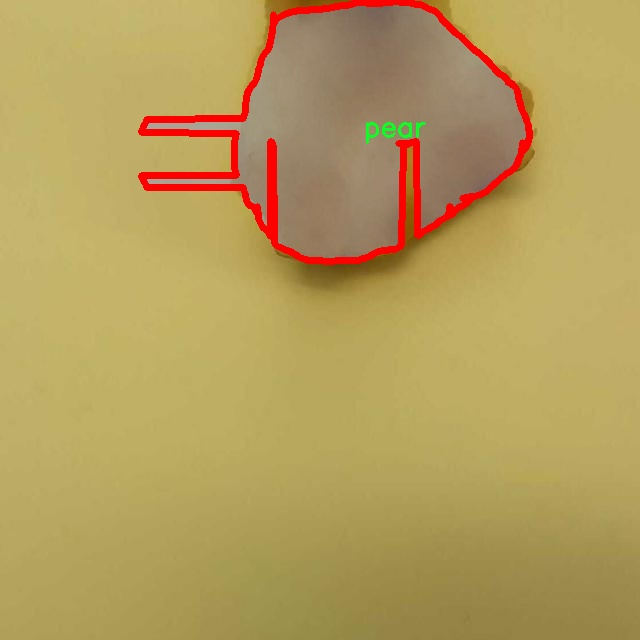
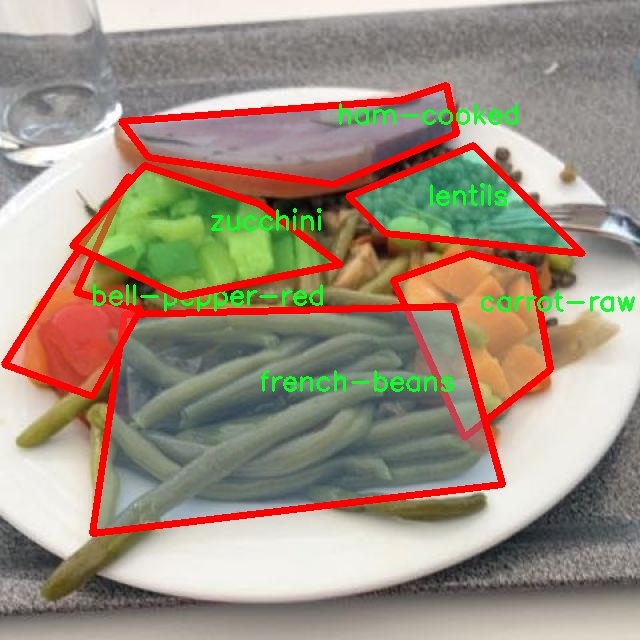
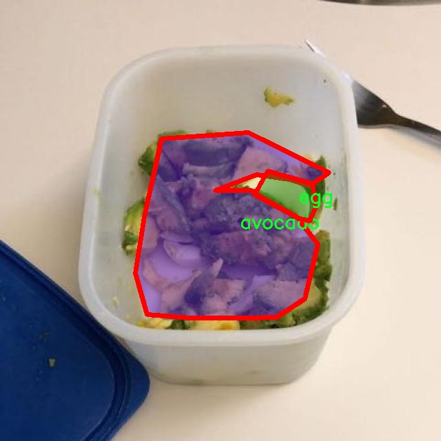

# 食品图像分割系统源码＆数据集分享
 [yolov8-seg-attention＆yolov8-seg-C2f-ContextGuided等50+全套改进创新点发刊_一键训练教程_Web前端展示]

### 1.研究背景与意义

项目参考[ILSVRC ImageNet Large Scale Visual Recognition Challenge](https://gitee.com/YOLOv8_YOLOv11_Segmentation_Studio/projects)

项目来源[AAAI Global Al lnnovation Contest](https://kdocs.cn/l/cszuIiCKVNis)

研究背景与意义

随着全球食品产业的快速发展，食品安全和营养健康问题日益受到重视。近年来，食品图像分析技术在食品质量监测、营养成分分析和智能饮食推荐等领域展现出广阔的应用前景。尤其是图像分割技术的进步，使得对食品图像的精确识别和分类成为可能。YOLO（You Only Look Once）系列模型作为一种高效的目标检测算法，凭借其实时性和准确性，已被广泛应用于各类图像处理任务中。然而，传统YOLO模型在处理复杂场景下的食品图像时，往往面临着分割精度不足和细节捕捉不够的问题。因此，基于改进YOLOv8的食品图像分割系统的研究具有重要的理论价值和实际意义。

本研究所使用的数据集包含8300张食品图像，涵盖248个类别，从新鲜水果、蔬菜到各类加工食品，种类繁多。这一丰富的数据集为训练和验证改进YOLOv8模型提供了坚实的基础。通过对不同食品类别的细致分割，研究不仅能够提高食品图像识别的准确性，还能为后续的营养分析和健康饮食推荐提供数据支持。例如，精确识别和分割出每种食品的图像，可以帮助消费者更好地了解所摄入食品的种类和营养成分，从而做出更健康的饮食选择。

此外，随着深度学习技术的不断发展，YOLOv8模型在网络结构和训练策略上进行了多项改进，使其在处理复杂背景和多样化目标时表现得更加出色。通过对YOLOv8的改进，可以进一步提升其在食品图像分割任务中的性能，特别是在处理相似食品或重叠食品时的精度。这对于食品行业的自动化检测、智能餐饮服务等应用场景具有重要的推动作用。

本研究的意义还在于填补现有文献中关于食品图像分割领域的空白。尽管已有一些研究尝试应用YOLO系列模型进行食品图像分析，但针对具体食品类别的精细化分割研究仍然较为稀缺。通过对YOLOv8模型的改进与优化，本研究将为食品图像分割提供新的思路和方法，推动该领域的进一步发展。

综上所述，基于改进YOLOv8的食品图像分割系统的研究，不仅具有重要的学术价值，也为实际应用提供了新的解决方案。通过提高食品图像的分割精度和效率，本研究将为食品安全、营养健康和智能饮食推荐等领域的深入研究奠定基础，助力实现更为智能化的食品管理和消费模式。

### 2.图片演示







##### 注意：由于此博客编辑较早，上面“2.图片演示”和“3.视频演示”展示的系统图片或者视频可能为老版本，新版本在老版本的基础上升级如下：（实际效果以升级的新版本为准）

  （1）适配了YOLOV8的“目标检测”模型和“实例分割”模型，通过加载相应的权重（.pt）文件即可自适应加载模型。

  （2）支持“图片识别”、“视频识别”、“摄像头实时识别”三种识别模式。

  （3）支持“图片识别”、“视频识别”、“摄像头实时识别”三种识别结果保存导出，解决手动导出（容易卡顿出现爆内存）存在的问题，识别完自动保存结果并导出到tempDir中。

  （4）支持Web前端系统中的标题、背景图等自定义修改，后面提供修改教程。

  另外本项目提供训练的数据集和训练教程,暂不提供权重文件（best.pt）,需要您按照教程进行训练后实现图片演示和Web前端界面演示的效果。

### 3.视频演示

[3.1 视频演示](https://www.bilibili.com/video/BV1Vr2BYpEpy/)

### 4.数据集信息展示

##### 4.1 本项目数据集详细数据（类别数＆类别名）

nc: 248
names: ['alfa-sprouts', 'almonds', 'anchovies', 'apple', 'apple-pie', 'apricot-dried', 'apricots', 'artichoke', 'avocado', 'bacon', 'bagel', 'baked-potato', 'banana', 'banana-cake', 'basil', 'bean-seeds', 'beans-kidney', 'beans-white', 'beef', 'beef-filet', 'beef-minced', 'beef-roast', 'beef-sirloin-steak', 'beef-stripes', 'beetroot', 'bell-pepper-red', 'berries', 'biscuits', 'black-olives', 'blackberry', 'blue-cheese', 'blueberries', 'brazil-nut', 'bread', 'bread-black', 'bread-white', 'bread-wholemeal', 'broccoli', 'brownie', 'brussel-sprouts', 'buckwheat-pancake', 'butter', 'cake-marble', 'candies', 'capers', 'carrot-cake', 'carrot-raw', 'carrot-steamed', 'cashew-nut', 'cauliflower', 'celeriac', 'celery', 'cheddar', 'cheese', 'cheesecake', 'cherries', 'chia-grains', 'chicken', 'chicken-breast', 'chicken-curry', 'chicken-leg', 'chicken-nuggets', 'chicken-stripes', 'chicken-wing', 'chickpeas', 'chili-con-carne', 'chinese-cabbage', 'chips-french-fries', 'chives', 'chocolate', 'chocolate-cake', 'chocolate-cookies', 'chocolate-egg-small', 'chocolate-mousse', 'chorizo', 'cocoa-powder', 'coconut', 'cod', 'coleslaw-chopped', 'cookies', 'corn', 'corn-crisps', 'corn-flakes', 'country-fries', 'couscous', 'crackers', 'cream', 'cream-cheese', 'cream-spinach', 'crepe-plain', 'croissant', 'croissant-wholegrain', 'cucumber', 'cucumber-pickled', 'curry-vegetarian', 'dairy-ice-cream', 'damson-plum', 'dark-chocolate', 'dates', 'dried-meat', 'dried-raisins', 'dried-tomatoes', 'dumplings', 'egg', 'eggplant', 'emmental-cheese', 'fennel', 'fig-dried', 'figs', 'fish', 'fish-crunchies-battered', 'fish-fingers-breaded', 'flakes-oat', 'focaccia', 'french-beans', 'fresh-cheese', 'fruit-salad', 'garlic', 'goat-cheese', 'goat-raw', 'grapes', 'greek-yogurt', 'green-asparagus', 'green-bean', 'green-olives', 'grissini', 'gruyere', 'guacamole', 'gummi-bears', 'halloumi', 'ham', 'ham-cooked', 'ham-raw', 'ham-turkey', 'hamburger', 'hamburger-bun', 'hazelnut', 'honey', 'hummus', 'jam', 'ketchup', 'kiwi', 'lamb', 'lamb-chop', 'lasagne', 'lasagne-vegetable', 'leaf-spinach', 'leek', 'lemon', 'lemon-cake', 'lemon-pie', 'lentils', 'm-ms', 'macaroon', 'mandarine', 'mango', 'mango-dried', 'margarine', 'mashed-potatoes', 'mayonnaise', 'meat', 'meat-balls', 'meatloaf', 'minced-meat', 'mousse', 'mozzarella', 'muesli', 'muffin', 'mungbean-sprouts', 'mushroom', 'mustard', 'nutella', 'nuts', 'oil', 'omelette-plain', 'onion', 'orange', 'orange-juice', 'pancakes', 'paprika-chips', 'parmesan', 'parsley', 'pasta', 'pasta-wholemeal', 'peach', 'peanut', 'peanut-butter', 'pear', 'pearl-onions', 'peas', 'perch-fillets-lake', 'pineapple', 'pistachio', 'pizza', 'plums', 'polenta', 'pomegranate', 'popcorn-salted', 'pork', 'pork-chop', 'pork-escalope', 'pork-roast', 'potato-gnocchi', 'potatoes-steamed', 'pretzel', 'processed-meat', 'pumpkin', 'quinoa', 'raspberries', 'ratatouille', 'red-cabbage', 'red-radish', 'rice', 'rice-noodles-vermicelli', 'rice-whole-grain', 'rocket', 'rusk-wholemeal', 'salami', 'salmon', 'salmon-smoked', 'sausage', 'savoy-cabbage', 'scrambled-egg', 'shrimp', 'spinach-raw', 'spinach-steamed', 'spring-onion-scallion', 'spring-roll-fried', 'strawberries', 'sweet-corn-canned', 'sweet-potato', 'swiss-chard', 'tartar-meat', 'tiramisu', 'tofu', 'tomato-raw', 'tomato-stewed', 'tuna', 'tuna-in-oil', 'veggie-burger', 'waffle', 'walnut', 'white-asparagus', 'white-cabbage', 'white-chocolate', 'white-radish', 'yogurt-natural', 'zucchini']


##### 4.2 本项目数据集信息介绍

数据集信息展示

在食品图像分割领域，"nutri_seg"数据集作为一个重要的资源，旨在支持改进YOLOv8-seg模型的训练与优化。该数据集包含248个类别，涵盖了广泛的食品种类，能够为图像分割任务提供丰富的样本和多样化的特征。这些类别不仅包括常见的水果、蔬菜和肉类，还涵盖了多种加工食品和甜点，充分反映了日常饮食的多样性和复杂性。

具体而言，"nutri_seg"数据集中的类别列表包括从新鲜的水果如苹果、香蕉、橙子，到各种坚果如杏仁、腰果和榛子，再到丰富的蔬菜如西红柿、胡萝卜和西兰花，以及多种肉类和海鲜，如鸡肉、牛肉、鱼类等。这些类别的多样性使得模型在处理不同类型的食品图像时，能够更好地学习到各类食品的特征和分割边界。例如，数据集中包含的“奶酪”、“巧克力”、“蛋糕”等甜品类食品，能够帮助模型识别和分割出这些在视觉上具有挑战性的对象。

此外，数据集还包括了许多常见的加工食品，如“薯条”、“汉堡”、“披萨”等，这些食品在快餐文化中占据重要地位。通过对这些食品的图像进行分割，模型能够学习到不同食品的形状、颜色和纹理特征，从而提高其在实际应用中的表现。更重要的是，数据集中还包含了如“豆腐”、“素食汉堡”等植物基食品，反映了现代饮食趋势的变化，满足了对健康饮食的需求。

在数据集的构建过程中，图像的采集和标注工作尤为重要。每个类别的图像均经过精心挑选和标注，确保了数据的质量和准确性。这不仅有助于模型的训练，也为后续的验证和测试提供了可靠的基础。通过使用高质量的图像，模型能够更好地捕捉到食品的细节特征，从而在分割任务中表现出色。

总之，"nutri_seg"数据集的丰富性和多样性为改进YOLOv8-seg的食品图像分割系统提供了坚实的基础。通过对248个类别的深入学习，模型能够在实际应用中实现高效、准确的食品识别与分割，为食品安全、营养分析及相关领域的研究提供了强有力的支持。随着技术的不断进步和数据集的持续扩展，未来的食品图像分割系统将能够更加智能化和自动化，为用户提供更为便捷的服务。











### 5.全套项目环境部署视频教程（零基础手把手教学）

[5.1 环境部署教程链接（零基础手把手教学）](https://www.bilibili.com/video/BV1jG4Ve4E9t/?vd_source=bc9aec86d164b67a7004b996143742dc)


[5.2 安装Python虚拟环境创建和依赖库安装视频教程链接（零基础手把手教学）](https://www.bilibili.com/video/BV1nA4VeYEze/?vd_source=bc9aec86d164b67a7004b996143742dc)

### 6.手把手YOLOV8-seg训练视频教程（零基础小白有手就能学会）

[6.1 手把手YOLOV8-seg训练视频教程（零基础小白有手就能学会）](https://www.bilibili.com/video/BV1cA4VeYETe/?vd_source=bc9aec86d164b67a7004b996143742dc)


按照上面的训练视频教程链接加载项目提供的数据集，运行train.py即可开始训练



     Epoch   gpu_mem       box       obj       cls    labels  img_size
     1/200     0G   0.01576   0.01955  0.007536        22      1280: 100%|██████████| 849/849 [14:42<00:00,  1.04s/it]
               Class     Images     Labels          P          R     mAP@.5 mAP@.5:.95: 100%|██████████| 213/213 [01:14<00:00,  2.87it/s]
                 all       3395      17314      0.994      0.957      0.0957      0.0843

     Epoch   gpu_mem       box       obj       cls    labels  img_size
     2/200     0G   0.01578   0.01923  0.007006        22      1280: 100%|██████████| 849/849 [14:44<00:00,  1.04s/it]
               Class     Images     Labels          P          R     mAP@.5 mAP@.5:.95: 100%|██████████| 213/213 [01:12<00:00,  2.95it/s]
                 all       3395      17314      0.996      0.956      0.0957      0.0845

     Epoch   gpu_mem       box       obj       cls    labels  img_size
     3/200     0G   0.01561    0.0191  0.006895        27      1280: 100%|██████████| 849/849 [10:56<00:00,  1.29it/s]
               Class     Images     Labels          P          R     mAP@.5 mAP@.5:.95: 100%|███████   | 187/213 [00:52<00:00,  4.04it/s]
                 all       3395      17314      0.996      0.957      0.0957      0.0845


### 7.50+种全套YOLOV8-seg创新点代码加载调参视频教程（一键加载写好的改进模型的配置文件）

[7.1 50+种全套YOLOV8-seg创新点代码加载调参视频教程（一键加载写好的改进模型的配置文件）](https://www.bilibili.com/video/BV1Hw4VePEXv/?vd_source=bc9aec86d164b67a7004b996143742dc)

### 8.YOLOV8-seg图像分割算法原理

原始YOLOV8-seg算法原理

YOLOv8-seg作为YOLO系列的最新进展，继承了YOLO系列一贯的高效性和实时性，同时在目标检测和分割任务中展现出更为卓越的性能。该算法的核心在于其结构设计与处理流程的创新，尤其是在处理复杂背景和小目标时的能力提升。YOLOv8-seg不仅仅是一个目标检测模型，更是一个集成了语义分割功能的多任务学习框架，旨在解决传统YOLO模型在复杂环境下的局限性。

YOLOv8-seg的网络结构主要由输入端、主干网络、Neck端和输出端四个模块组成。输入端负责对输入图像进行预处理，包括Mosaic数据增强、自适应图片缩放和灰度填充等操作，以增强模型的鲁棒性和适应性。通过这些预处理步骤，YOLOv8-seg能够更好地应对不同光照、背景和目标特征的变化，从而为后续的特征提取打下良好的基础。

在主干网络中，YOLOv8-seg采用了卷积、池化等操作来提取图像特征。与前代模型相比，YOLOv8-seg引入了C2f模块，该模块借鉴了YOLOv7中的E-ELAN结构，通过跨层分支连接增强了模型的梯度流。这种设计使得特征提取过程中的信息流动更加顺畅，从而提升了模型对复杂特征的捕捉能力。主干网络的末尾，SPPFl模块通过多尺度最大池化的方式进一步增强了特征的抽象能力，使得模型在面对不同尺度的目标时能够保持良好的检测性能。

Neck端的设计是YOLOv8-seg的另一大亮点。该模块基于PAN（Path Aggregation Network）结构，通过上采样、下采样和特征拼接等操作，融合来自不同尺度的特征图信息。这种特征融合的策略使得模型能够在多尺度特征之间建立更为紧密的联系，从而提升对小目标的检测能力。为了进一步优化特征传递过程，YOLOv8-seg在Neck端引入了GSConv和Slim-neck技术，这不仅保持了模型的精度，还有效降低了计算量，使得模型在实时应用中表现更加出色。

在输出端，YOLOv8-seg采用了解耦合的检测头结构，这一结构将分类和回归过程分离，使得模型在处理目标检测和分割任务时能够更加高效。通过正负样本匹配和损失计算的优化，YOLOv8-seg能够更准确地识别目标并进行分割。特别是在小目标检测方面，YOLOv8-seg通过添加更小的检测头，显著提升了对小目标的感知能力。这一改进使得模型在复杂水面环境下，能够更好地识别和定位漂浮物等小目标，解决了传统YOLO模型在此类场景下的定位误差和感知不足的问题。

为了进一步提升模型的泛化能力和精准度，YOLOv8-seg还对损失函数进行了改进，采用了MPDIoU损失函数替代了CIoU损失函数。这一改进使得模型在训练过程中能够更好地适应不同场景的变化，提高了检测和分割的准确性。MPDIoU损失函数通过考虑目标的多种几何特征，能够更全面地评估预测框与真实框之间的差异，从而引导模型学习到更为精确的目标定位。

总的来说，YOLOv8-seg算法通过一系列创新设计和技术改进，成功克服了传统YOLO模型在复杂环境下的局限性，特别是在小目标检测和分割任务中展现出更为卓越的性能。其在多任务学习框架下的高效性和实时性，使得YOLOv8-seg在实际应用中具有广泛的前景，尤其是在水面环境等复杂场景中的应用潜力更为显著。随着YOLOv8-seg的不断发展和优化，未来在目标检测和分割领域的应用将更加广泛，推动计算机视觉技术的进一步进步。


### 9.系统功能展示（检测对象为举例，实际内容以本项目数据集为准）

图9.1.系统支持检测结果表格显示

  图9.2.系统支持置信度和IOU阈值手动调节

  图9.3.系统支持自定义加载权重文件best.pt(需要你通过步骤5中训练获得)

  图9.4.系统支持摄像头实时识别

  图9.5.系统支持图片识别

  图9.6.系统支持视频识别

  图9.7.系统支持识别结果文件自动保存

  图9.8.系统支持Excel导出检测结果数据


### 10.50+种全套YOLOV8-seg创新点原理讲解（非科班也可以轻松写刊发刊，V11版本正在科研待更新）

#### 10.1 由于篇幅限制，每个创新点的具体原理讲解就不一一展开，具体见下列网址中的创新点对应子项目的技术原理博客网址【Blog】：


[10.1 50+种全套YOLOV8-seg创新点原理讲解链接](https://gitee.com/qunmasj/good)

#### 10.2 部分改进模块原理讲解(完整的改进原理见上图和技术博客链接)【如果此小节的图加载失败可以通过CSDN或者Github搜索该博客的标题访问原始博客，原始博客图片显示正常】
### 深度学习基础
卷积神经网络通过使用具有共享参数的卷积运算显著降低了模型的计算开销和复杂性。在LeNet、AlexNet和VGG等经典网络的驱动下，卷积神经网络现在已经建立了一个完整的系统，并在深度学习领域形成了先进的卷积神经网络模型。

感受野注意力卷积RFCBAMConv的作者在仔细研究了卷积运算之后获得了灵感。对于分类、目标检测和语义分割任务，一方面，图像中不同位置的对象的形状、大小、颜色和分布是可变的。在卷积操作期间，卷积核在每个感受野中使用相同的参数来提取信息，而不考虑来自不同位置的差分信息。这限制了网络的性能，这已经在最近的许多工作中得到了证实。

另一方面，卷积运算没有考虑每个特征的重要性，这进一步影响了提取特征的有效性，并最终限制了模型的性能。此外，注意力机制允许模型专注于重要特征，这可以增强特征提取的优势和卷积神经网络捕获详细特征信息的能力。因此，注意力机制在深度学习中得到了广泛的应用，并成功地应用于各个领域。

通过研究卷积运算的内在缺陷和注意力机制的特点，作者认为现有的空间注意力机制从本质上解决了卷积运算的参数共享问题，但仍局限于对空间特征的认知。对于较大的卷积核，现有的空间注意力机制并没有完全解决共享参数的问题。此外，他们无法强调感受野中每个特征的重要性，例如现有的卷积块注意力模块（CBAM）和 Coordinate注意力（CA）。

因此，[参考该博客提出了一种新的感受野注意力机制（RFA）](https://qunmasj.com)，它完全解决了卷积核共享参数的问题，并充分考虑了感受野中每个特征的重要性。通过RFA设计的卷积运算（RFAConv）是一种新的卷积运算，可以取代现有神经网络中的标准卷积运算。RFAConv通过添加一些参数和计算开销来提高网络性能。

大量关于Imagnet-1k、MS COCO和VOC的实验已经证明了RFAConv的有效性。作为一种由注意力构建的新型卷积运算，它超过了由CAM、CBAM和CA构建的卷积运算（CAMConv、CBAMConv、CAConv）以及标准卷积运算。

此外，为了解决现有方法提取感受野特征速度慢的问题，提出了一种轻量级操作。在构建RFAConv的过程中，再次设计了CA和CBAM的升级版本，并进行了相关实验。作者认为当前的空间注意力机制应该将注意力放在感受野空间特征上，以促进当前空间注意力机制的发展，并再次增强卷积神经网络架构的优势。


### 卷积神经网络架构
出色的神经网络架构可以提高不同任务的性能。卷积运算作为卷积神经网络的一种基本运算，推动了人工智能的发展，并为车辆检测、无人机图像、医学等先进的网络模型做出了贡献。He等人认为随着网络深度的增加，该模型将变得难以训练并产生退化现象，因此他们提出了残差连接来创新卷积神经网络架构的设计。Huang等人通过重用特征来解决网络梯度消失问题，增强了特征信息，他们再次创新了卷积神经网络架构。

通过对卷积运算的详细研究，Dai等人认为，具有固定采样位置的卷积运算在一定程度上限制了网络的性能，因此提出了Deformable Conv，通过学习偏移来改变卷积核的采样位置。在Deformable Conv的基础上，再次提出了Deformable Conv V2和Deformable Conv V3，以提高卷积网络的性能。

Zhang等人注意到，组卷积可以减少模型的参数数量和计算开销。然而，少于组内信息的交互将影响最终的网络性能。1×1的卷积可以与信息相互作用。然而，这将带来更多的参数和计算开销，因此他们提出了无参数的“通道Shuffle”操作来与组之间的信息交互。

Ma等人通过实验得出结论，对于参数较少的模型，推理速度不一定更快，对于计算量较小的模型，推理也不一定更快。经过仔细研究提出了Shufflenet V2。

YOLO将输入图像划分为网格，以预测对象的位置和类别。经过不断的研究，已经提出了8个版本的基于YOLO的目标检测器，如YOLOv5、YOLOv7、YOLOv8等。上述卷积神经网络架构已经取得了巨大的成功。然而，它们并没有解决提取特征过程中的参数共享问题。本文的工作从注意力机制开始，从一个新的角度解决卷积参数共享问题。

### 注意力机制
注意力机制被用作一种提高网络模型性能的技术，使其能够专注于关键特性。注意力机制理论已经在深度学习中建立了一个完整而成熟的体系。Hu等人提出了一种Squeeze-and-Excitation（SE）块，通过压缩特征来聚合全局通道信息，从而获得与每个通道对应的权重。Wang等人认为，当SE与信息交互时，单个通道和权重之间的对应关系是间接的，因此设计了高效通道注Efficient Channel Attention力（ECA），并用自适应kernel大小的一维卷积取代了SE中的全连接（FC）层。Woo等人提出了卷积块注意力模块（CBAM），它结合了通道注意力和空间注意力。作为一个即插即用模块，它可以嵌入卷积神经网络中，以提高网络性能。

尽管SE和CBAM已经提高了网络的性能。Hou等人仍然发现压缩特征在SE和CBAM中丢失了太多信息。因此，他们提出了轻量级Coordinate注意力（CA）来解决SE和CBAM中的问题。Fu等人计了一个空间注意力模块和通道注意力模块，用于扩展全卷积网络（FCN），分别对空间维度和通道维度的语义相关性进行建模。Zhang等人在通道上生成不同尺度的特征图，以建立更有效的通道注意力机制。

本文从一个新的角度解决了标准卷积运算的参数共享问题。这就是将注意力机制结合起来构造卷积运算。尽管目前的注意力机制已经获得了良好的性能，但它们仍然没有关注感受野的空间特征。因此，设计了具有非共享参数的RFA卷积运算，以提高网络的性能。


#### 回顾标准卷积
以标准卷积运算为基础构建卷积神经网络，通过共享参数的滑动窗口提取特征信息，解决了全连接层构建的神经网络的固有问题（即参数数量大、计算开销高）。

设表示输入特征图，其中、和分别表示特征图的通道数、高度和宽度。为了能够清楚地展示卷积核提取特征信息的过程，以为例。提取每个感受野slider的特征信息的卷积运算可以表示如下：


这里，表示在每次卷积slider操作之后获得的值，表示在每个slider内的相应位置处的像素值。表示卷积核，表示卷积核中的参数数量，表示感受野slider的总数。

可以看出，每个slider内相同位置的特征共享相同的参数。因此，标准的卷积运算无法感知不同位置带来的差异信息，这在一定程度上限制了卷积神经网络的性能。

#### 回顾空间注意力
目前，空间注意力机制使用通过学习获得的注意力图来突出每个特征的重要性。与上一节类似，以为例。突出关键特征的空间注意力机制可以简单地表达如下：


这里，表示在加权运算之后获得的值。和分别表示输入特征图和学习注意力图在不同位置的值，是输入特征图的高度和宽度的乘积，表示像素值的总数。一般来说，整个过程可以简单地表示在图1中。


#### 空间注意力与标准卷积
众所周知，将注意力机制引入卷积神经网络可以提高网络的性能。通过标准的卷积运算和对现有空间注意力机制的仔细分析。作者认为空间注意力机制本质上解决了卷积神经网络的固有缺点，即共享参数的问题。

目前，该模型最常见的卷积核大小为1×1和3×3。引入空间注意力机制后用于提取特征的卷积操作是1×1或3×3卷积操作。这个过程可以直观地显示出来。空间注意力机制被插入到1×1卷积运算的前面。通过注意力图对输入特征图进行加权运算（Re-weight“×”），最后通过1×1卷积运算提取感受野的slider特征信息。

整个过程可以简单地表示如下：


 

这里，卷积核仅表示一个参数值。如果将的值作为一个新的卷积核参数，那么有趣的是，通过1×1卷积运算提取特征时的参数共享问题得到了解决。然而，空间注意力机制的传说到此结束。当空间注意力机制被插入到3×3卷积运算的前面时。具体情况如下：


如上所述，如果取的值。作为一种新的卷积核参数，上述方程完全解决了大规模卷积核的参数共享问题。然而，最重要的一点是，卷积核在每个感受野slider中提取将共享部分特征的特征。换句话说，在每个感受野slider内都会有重叠。

经过仔细分析发现，，…，空间注意力图的权重在每个slider内共享。因此，空间注意机制不能解决大规模卷积核共享参数的问题，因为它们不注意感受野的空间特征。在这种情况下，空间注意力机制是有限的。
#### 创新空间注意力与标准卷积
RFA是为了解决空间注意力机制问题而提出的，创新了空间注意力。使用与RFA相同的思想，一系列空间注意力机制可以再次提高性能。RFA设计的卷积运算可以被视为一种轻量级的即插即用模块，以取代标准卷积，从而提高卷积神经网络的性能。因此，作者认为空间注意力机制和标准卷积在未来将有一个新的春天。

感受野的空间特征：

现在给出感受野空间特征的定义。它是专门为卷积核设计的，并根据kernel大小动态生成，如图2所示，以3×3卷积核为例。


在图2中，“空间特征”表示原始特征图，等于空间特征。“感受野空间特征”表示变换后的特征，该特征由每个感受野slider滑块组成，并且不重叠。也就是说，“感受野空间特征”中的每个3×3大小的slider表示提取原始3×3卷积特征时所有感觉野slider的特征。

#### 感受野注意力卷积(RFA):

关于感受野空间特征，该博客的作者提出了感受野注意（RFA），它不仅强调了感受野slider内各种特征的重要性，而且还关注感受野空间特性，以彻底解决卷积核参数共享的问题。感受野空间特征是根据卷积核的大小动态生成的，因此，RFA是卷积的固定组合，不能脱离卷积运算的帮助，卷积运算同时依赖RFA来提高性能。

因此，作者提出了感受野注意力卷积（RFAConv）。具有3×3大小卷积核的RFAConv的总体结构如图3所示。


目前，提取感受野特征最常用的方法速度较慢，因此经过不断探索提出了一种快速的方法，通过分组卷积来取代原来的方法。

具体来说，根据感受野大小，使用相应的组卷积大小来动态生成展开特征。尽管与原始的无参数方法（如Pytorch提供的nn.Unfld()）相比，该方法添加了一些参数，但速度要快得多。

注意：正如在上一节中提到的，当原始的3×3卷积核提取特征时，感受野空间特征中的每个3×3大小的窗口表示所有感受野滑块的特征。但在快速分组卷积提取感受野特征后，由于原始方法太慢，它们会被映射到新的特征中。

最近的一些工作已经证明信息交互可以提高网络性能。类似地，对于RFAConv，与感受野特征信息交互以学习注意力图可以提高网络性能，但与每个感受野特征交互将带来额外的计算开销。为了确保少量的计算开销和参数数量，通过探索使用AvgPool池化每个感受野特征的全局信息，然后通过1×1组卷积运算与信息交互。最后，softmax用于强调感受野特征中每个特征的重要性。通常，RFA的计算可以表示为：


表示分组卷积，表示卷积核的大小，代表规范化，表示输入特征图，是通过将注意力图与变换的感受野空间特征相乘而获得的。

与CBAM和CA不同，RFA可以为每个感受野特征生成注意力图。标准卷积受到卷积神经网络性能的限制，因为共享参数的卷积运算对位置带来的差异信息不敏感。RFA完全可以解决这个问题，具体细节如下：


由于RFA获得的特征图是“调整形状”后不重叠的感受野空间特征，因此通过池化每个感受野滑块的特征信息来学习学习的注意力图。换句话说，RFA学习的注意力图不再在每个感受野slider内共享，并且是有效的。这完全解决了现有的CA和CBAM对大尺寸kernel的注意力机制中的参数共享问题。

同时，RFA给标准卷积核带来了相当大的好处，但调整形状后，特征的高度和宽度是k倍，需要进行k×k的stride卷积运算，才能提取特征信息。RFAConv创新了标准卷积运算。

此外，空间注意力机制将得到升级，因为作者认为现有的空间注意力机制应该专注于感受野空间特征，以提高网络的性能。众所周知，基于自注意力机制的网络模型取得了巨大的成功，因为它解决了卷积参数共享的问题，并对远程信息进行了建模，但基于自注意力机理的方法给模型带来了巨大的计算开销和复杂性。作者认为通过将一些现有空间注意力机制的注意力放在感受野空间特征中，它以轻量级的方式解决了自注意力机制的问题。

答案如下：

将关注感受野空间特征的空间注意力与卷积相匹配，完全解决了卷积参数共享的问题；

当前的空间注意力机制本身具有考虑远距离信息的特点，它们通过全局平均池化或全局最大池化来获得全局信息，这在一定程度上考虑了远距离信息。


为此，作者设计了一种新的CBAM和CA，称为RFACBAM和RFACA，它专注于感受野的空间特征。与RFA类似，使用stride为k的k×k的最终卷积运算来提取特征信息，具体结构如图4和图5所示，将这2种新的卷积方法称为RFCBAMConv和RFCAConv。比较原始的CBAM，使用SE注意力来代替RFCBAM中的CAM。因为这样可以减少计算开销。


此外，在RFCBAM中，通道和空间注意力不是在单独的步骤中执行的，因为通道和空间注意力是同时加权的，从而允许在每个通道上获得的注意力图是不同的。


### 11.项目核心源码讲解（再也不用担心看不懂代码逻辑）

#### 11.1 ultralytics\nn\extra_modules\block.py

以下是对您提供的代码的核心部分进行的分析和详细注释。为了保持代码的简洁性和可读性，我将只保留最重要的类和函数，并为其添加中文注释。

```python
import torch
import torch.nn as nn
import torch.nn.functional as F

def autopad(k, p=None, d=1):
    """自动填充以保持输出形状与输入形状相同。"""
    if d > 1:
        k = d * (k - 1) + 1 if isinstance(k, int) else [d * (x - 1) + 1 for x in k]  # 实际的卷积核大小
    if p is None:
        p = k // 2 if isinstance(k, int) else [x // 2 for x in k]  # 自动填充
    return p

class Conv(nn.Module):
    """标准卷积层，包含卷积、批归一化和激活函数。"""
    def __init__(self, in_channels, out_channels, kernel_size=3, stride=1, padding=None, groups=1, act=True):
        super().__init__()
        self.conv = nn.Conv2d(in_channels, out_channels, kernel_size, stride, autopad(kernel_size, padding), groups=groups, bias=False)
        self.bn = nn.BatchNorm2d(out_channels)
        self.act = nn.ReLU() if act else nn.Identity()

    def forward(self, x):
        return self.act(self.bn(self.conv(x)))

class DyReLU(nn.Module):
    """动态ReLU激活函数，能够根据输入动态调整输出。"""
    def __init__(self, inp, reduction=4):
        super(DyReLU, self).__init__()
        self.fc = nn.Sequential(
            nn.Linear(inp, inp // reduction),
            nn.ReLU(inplace=True),
            nn.Linear(inp // reduction, inp)
        )

    def forward(self, x):
        return x * torch.sigmoid(self.fc(x))

class DyHeadBlock(nn.Module):
    """动态头部块，结合多种注意力机制。"""
    def __init__(self, in_channels):
        super().__init__()
        self.spatial_conv = Conv(in_channels, in_channels)
        self.offset_conv = nn.Conv2d(in_channels, 3 * 3 * 3, 3, padding=1)  # 计算偏移量和掩码

    def forward(self, x):
        offset_and_mask = self.offset_conv(x)
        # 处理偏移量和掩码
        return self.spatial_conv(x)  # 进行空间卷积

class Fusion(nn.Module):
    """融合模块，用于结合多个输入特征图。"""
    def __init__(self, inc_list):
        super().__init__()
        self.fusion_conv = nn.ModuleList([Conv(inc, inc, 1) for inc in inc_list])

    def forward(self, x):
        for i in range(len(x)):
            x[i] = self.fusion_conv[i](x[i])
        return torch.cat(x, dim=1)  # 连接特征图

class C3(nn.Module):
    """C3模块，包含多个基本块。"""
    def __init__(self, c1, c2, n=1):
        super().__init__()
        self.m = nn.Sequential(*(Conv(c1, c2) for _ in range(n)))

    def forward(self, x):
        return self.m(x)

# 其他类和函数可以根据需要进行类似的处理
```

### 代码分析与注释说明
1. **autopad**: 该函数用于自动计算填充量，以确保卷积操作后输出的特征图大小与输入特征图相同。
2. **Conv**: 这是一个自定义的卷积层，包含卷积、批归一化和激活函数，便于在网络中复用。
3. **DyReLU**: 动态ReLU激活函数，能够根据输入动态调整输出，增强模型的表达能力。
4. **DyHeadBlock**: 该模块结合了动态卷积和偏移量计算，用于实现更复杂的特征提取。
5. **Fusion**: 融合模块，用于将多个输入特征图结合成一个输出特征图，常用于特征融合。
6. **C3**: 这是一个包含多个基本卷积块的模块，适用于构建深层网络。

### 结论
以上是对您提供的代码的核心部分进行了提炼和注释，帮助理解每个模块的功能和作用。您可以根据具体需求进一步扩展或修改这些模块。

这个文件 `ultralytics/nn/extra_modules/block.py` 是一个深度学习模型的模块实现，主要用于构建各种神经网络的基本构件，特别是在目标检测和图像处理任务中。以下是对文件中主要内容的逐步分析和说明。

首先，文件导入了一些必要的库，包括 PyTorch、NumPy 和其他自定义模块。这些库提供了构建神经网络所需的基础功能。

接下来，文件定义了一些通用的辅助函数，例如 `autopad` 用于自动计算卷积层的填充，以确保输出尺寸与输入相同。还有 `_make_divisible` 函数用于确保某个数是可被特定值整除的。

文件中包含了多个类，每个类实现了不同的模块或层。以下是一些关键类的说明：

1. **激活函数类**：如 `swish`、`h_swish` 和 `h_sigmoid`，这些类实现了不同的激活函数，通常用于神经网络的非线性变换。

2. **DyReLU**：这是一个动态 ReLU 类，具有自适应特性，能够根据输入的特征动态调整其输出。

3. **DyHeadBlock** 和 **DyHeadBlockWithDCNV3**：这些类实现了动态头部模块，结合了注意力机制和可变形卷积，适用于目标检测等任务。

4. **Fusion**：这个类实现了特征融合的不同策略，如加权融合、适应性融合等，通常用于将不同层的特征图合并。

5. **Partial_conv3** 和 **Faster_Block**：这些类实现了特定的卷积块，结合了不同的卷积策略和残差连接。

6. **C3_Faster** 和 **C2f_Faster**：这些类实现了特定的网络结构，通常用于提高模型的性能和效率。

7. **各种卷积模块**：如 `OD_Attention`、`EMSConv`、`SCConv` 等，都是针对特定任务或特定结构设计的卷积模块，旨在提高模型的表达能力和计算效率。

8. **注意力机制**：如 `ContextGuidedBlock` 和 `FocusedLinearAttention`，这些模块通过引入注意力机制来增强模型对重要特征的关注。

9. **自适应池化**：如 `PyramidPoolAgg`，实现了自适应池化层，用于处理不同尺寸的输入特征图。

文件中还包含了一些复杂的网络结构，如 `C3` 和 `C2f`，这些结构通常用于构建更深层次的网络，支持多种不同的特征提取和融合策略。

总的来说，这个文件提供了多种神经网络模块的实现，涵盖了从基本的卷积层到复杂的注意力机制和特征融合策略，适用于构建现代深度学习模型，尤其是在计算机视觉领域。通过这些模块，用户可以灵活地组合和构建符合特定需求的网络结构。

#### 11.2 ultralytics\nn\extra_modules\ops_dcnv3\functions\__init__.py

以下是保留的核心部分代码，并附上详细的中文注释：

```python
# 导入DCNv3Function和dcnv3_core_pytorch模块
from .dcnv3_func import DCNv3Function, dcnv3_core_pytorch

# DCNv3Function：这是一个自定义的深度可分离卷积（Deformable Convolution）功能类，用于实现可变形卷积的前向和反向传播。
# dcnv3_core_pytorch：这是实现可变形卷积的核心功能，可能包含底层的PyTorch操作和计算图的构建。
```

在这段代码中，主要的功能是导入可变形卷积相关的函数和类，以便在后续的代码中使用这些功能来实现特定的深度学习任务。

这个程序文件是一个Python模块的初始化文件，位于`ultralytics/nn/extra_modules/ops_dcnv3/functions/`目录下。文件的开头包含了一些版权信息，表明该代码是由OpenGVLab于2022年开发的，并且它是根据MIT许可证进行授权的，这意味着用户可以自由使用、修改和分发该代码，只要遵循许可证的条款。

在文件的主体部分，代码通过`from`语句导入了两个对象：`DCNv3Function`和`dcnv3_core_pytorch`。这两个对象是从同一目录下的`dcnv3_func`模块中引入的。`DCNv3Function`可能是一个自定义的函数或类，涉及到深度学习中的某种操作，而`dcnv3_core_pytorch`则可能是与PyTorch框架相关的核心功能实现。

这个初始化文件的作用是将`dcnv3_func`模块中的特定功能暴露给其他模块或程序，使得用户在导入`functions`模块时，可以直接使用这两个对象，而无需直接引用`dcnv3_func`模块。这种做法有助于提高代码的可读性和可维护性。

#### 11.3 ui.py

```python
import sys
import subprocess

def run_script(script_path):
    """
    使用当前 Python 环境运行指定的脚本。

    Args:
        script_path (str): 要运行的脚本路径

    Returns:
        None
    """
    # 获取当前 Python 解释器的路径
    python_path = sys.executable

    # 构建运行命令，使用 streamlit 运行指定的脚本
    command = f'"{python_path}" -m streamlit run "{script_path}"'

    # 执行命令
    result = subprocess.run(command, shell=True)
    # 检查命令执行结果，如果返回码不为0，表示出错
    if result.returncode != 0:
        print("脚本运行出错。")

# 实例化并运行应用
if __name__ == "__main__":
    # 指定要运行的脚本路径
    script_path = "web.py"  # 这里可以直接指定脚本名称

    # 运行脚本
    run_script(script_path)
```

### 代码核心部分及注释说明：

1. **导入模块**：
   - `import sys`: 导入 sys 模块以获取 Python 解释器的路径。
   - `import subprocess`: 导入 subprocess 模块以便于执行外部命令。

2. **定义 `run_script` 函数**：
   - 该函数接受一个参数 `script_path`，表示要运行的 Python 脚本的路径。
   - 使用 `sys.executable` 获取当前 Python 解释器的路径。
   - 构建一个命令字符串，使用 `streamlit` 模块运行指定的脚本。
   - 使用 `subprocess.run` 执行构建的命令，并检查返回码以判断脚本是否成功运行。

3. **主程序入口**：
   - 使用 `if __name__ == "__main__":` 确保只有在直接运行该脚本时才会执行以下代码。
   - 指定要运行的脚本路径（在这里是 `web.py`）。
   - 调用 `run_script` 函数来执行指定的脚本。

这个程序文件的主要功能是使用当前的 Python 环境来运行一个指定的脚本，具体是通过 Streamlit 来启动一个 Web 应用。程序首先导入了必要的模块，包括 `sys`、`os` 和 `subprocess`，这些模块提供了与系统交互和执行外部命令的功能。此外，还导入了 `abs_path` 函数，这个函数来自于 `QtFusion.path` 模块，用于获取文件的绝对路径。

在 `run_script` 函数中，首先定义了一个参数 `script_path`，用于接收要运行的脚本的路径。函数内部通过 `sys.executable` 获取当前 Python 解释器的路径，然后构建一个命令字符串，这个命令字符串的格式是 `"python_path" -m streamlit run "script_path"`，其中 `python_path` 是当前 Python 解释器的路径，`script_path` 是要运行的脚本的路径。

接下来，使用 `subprocess.run` 方法来执行这个命令。`shell=True` 参数表示在 shell 中执行命令。如果命令执行的返回码不为 0，说明脚本运行出错，程序会打印出“脚本运行出错。”的提示信息。

在文件的最后部分，使用 `if __name__ == "__main__":` 来判断是否是直接运行该脚本。如果是，程序会调用 `abs_path` 函数来获取 `web.py` 脚本的绝对路径，并将其传递给 `run_script` 函数，从而启动这个 Web 应用。

总体来说，这个程序的作用是方便用户在当前 Python 环境中运行一个名为 `web.py` 的 Streamlit 脚本，提供了一种简单的方式来启动 Web 应用。

#### 11.4 ultralytics\models\yolo\pose\__init__.py

以下是代码中最核心的部分，并附上详细的中文注释：

```python
# 导入必要的模块
from .predict import PosePredictor  # 导入姿态预测器类
from .train import PoseTrainer      # 导入姿态训练器类
from .val import PoseValidator       # 导入姿态验证器类

# 定义模块的公开接口
__all__ = 'PoseTrainer', 'PoseValidator', 'PosePredictor'  # 指定可以被外部访问的类
```

### 注释说明：
1. **导入模块**：
   - `from .predict import PosePredictor`：从当前包的 `predict` 模块中导入 `PosePredictor` 类，用于进行姿态预测。
   - `from .train import PoseTrainer`：从当前包的 `train` 模块中导入 `PoseTrainer` 类，用于训练姿态模型。
   - `from .val import PoseValidator`：从当前包的 `val` 模块中导入 `PoseValidator` 类，用于验证姿态模型的性能。

2. **定义公开接口**：
   - `__all__` 是一个特殊变量，用于定义模块的公共接口。当使用 `from module import *` 时，只有在 `__all__` 中列出的名称会被导入。这里列出了 `PoseTrainer`、`PoseValidator` 和 `PosePredictor`，表示这些类是该模块的主要功能部分，可以被外部访问。

这个程序文件是Ultralytics YOLO项目中的一个模块，主要用于姿态估计（Pose Estimation）。文件名为`__init__.py`，它的存在使得Python将该目录视为一个包。

在文件的开头，有一个注释行，表明这个项目是Ultralytics YOLO的一部分，并且遵循AGPL-3.0许可证。这说明该项目是开源的，用户可以自由使用和修改，但需要遵循相应的许可证条款。

接下来，文件通过相对导入的方式引入了三个类：`PosePredictor`、`PoseTrainer`和`PoseValidator`。这些类分别用于姿态预测、姿态训练和姿态验证。具体来说，`PosePredictor`可能负责从输入数据中预测人体的姿态，`PoseTrainer`用于训练模型以提高其在姿态估计任务上的表现，而`PoseValidator`则用于验证模型的性能，确保其在测试集上的效果。

最后，`__all__`变量定义了当使用`from module import *`语句时，哪些名称会被导入。在这里，它包含了`PoseTrainer`、`PoseValidator`和`PosePredictor`，这意味着这三个类是该模块的主要接口，用户可以直接使用它们。

总的来说，这个文件的主要功能是组织和导出与姿态估计相关的核心类，方便其他模块或用户进行调用和使用。

#### 11.5 ultralytics\engine\trainer.py

以下是经过简化并注释的核心代码部分，主要保留了训练模型的逻辑和必要的功能。

```python
class BaseTrainer:
    """
    BaseTrainer类用于训练模型的基础类。
    """

    def __init__(self, cfg=DEFAULT_CFG, overrides=None, _callbacks=None):
        """
        初始化BaseTrainer类。

        参数:
            cfg (str, optional): 配置文件路径，默认为DEFAULT_CFG。
            overrides (dict, optional): 配置覆盖，默认为None。
        """
        # 获取配置
        self.args = get_cfg(cfg, overrides)
        self.check_resume(overrides)  # 检查是否需要从检查点恢复训练
        self.device = select_device(self.args.device, self.args.batch)  # 选择训练设备
        self.model = None  # 模型实例
        self.trainset, self.testset = None, None  # 训练集和测试集
        self.best_fitness = None  # 最佳适应度
        self.start_epoch = 0  # 开始训练的epoch
        self.epochs = self.args.epochs  # 总训练epoch数

        # 创建保存目录
        self.save_dir = get_save_dir(self.args)
        self.wdir = self.save_dir / 'weights'  # 权重保存目录
        if RANK in (-1, 0):
            self.wdir.mkdir(parents=True, exist_ok=True)  # 创建目录
            yaml_save(self.save_dir / 'args.yaml', vars(self.args))  # 保存参数

        # 数据集检查
        self.data = check_det_dataset(self.args.data)  # 检查数据集
        self.trainset, self.testset = self.get_dataset(self.data)  # 获取训练和测试数据集

        # 优化器和调度器初始化
        self.optimizer = None
        self.scheduler = None

    def train(self):
        """开始训练过程。"""
        world_size = len(self.args.device.split(',')) if isinstance(self.args.device, str) else 1  # 获取设备数量

        if world_size > 1 and 'LOCAL_RANK' not in os.environ:
            # 如果是多GPU训练，生成DDP命令并运行
            cmd, file = generate_ddp_command(world_size, self)
            subprocess.run(cmd, check=True)  # 运行命令
            ddp_cleanup(self, str(file))  # 清理DDP

        else:
            self._do_train(world_size)  # 单GPU训练

    def _do_train(self, world_size=1):
        """执行训练过程。"""
        self._setup_train(world_size)  # 设置训练参数和数据加载器

        for epoch in range(self.start_epoch, self.epochs):
            self.model.train()  # 设置模型为训练模式
            for i, batch in enumerate(self.train_loader):  # 遍历训练数据
                self.optimizer.zero_grad()  # 清空梯度
                loss, loss_items = self.model(batch)  # 前向传播计算损失
                loss.backward()  # 反向传播
                self.optimizer.step()  # 更新优化器

            # 每个epoch结束后进行验证和保存模型
            self.validate_and_save(epoch)

    def validate_and_save(self, epoch):
        """验证模型并保存检查点。"""
        metrics, fitness = self.validate()  # 验证模型
        if self.best_fitness is None or fitness > self.best_fitness:
            self.best_fitness = fitness  # 更新最佳适应度
            self.save_model()  # 保存模型

    def save_model(self):
        """保存模型检查点。"""
        ckpt = {
            'epoch': self.start_epoch,
            'best_fitness': self.best_fitness,
            'model': deepcopy(self.model).half(),  # 深拷贝模型并转换为半精度
            'optimizer': self.optimizer.state_dict(),  # 保存优化器状态
            'train_args': vars(self.args),  # 保存训练参数
        }
        torch.save(ckpt, self.wdir / 'last.pt')  # 保存最后的检查点

    def validate(self):
        """验证模型并返回性能指标。"""
        # 这里可以实现验证逻辑，返回指标和适应度
        return {}, 0.0  # 示例返回

    @staticmethod
    def get_dataset(data):
        """从数据字典中获取训练和验证路径。"""
        return data['train'], data.get('val') or data.get('test')  # 返回训练集和验证集路径
```

### 代码注释说明
1. **类和方法定义**：定义了一个`BaseTrainer`类，用于训练模型的基础功能。
2. **初始化方法**：在`__init__`方法中，加载配置、检查是否需要恢复训练、选择设备、创建保存目录等。
3. **训练方法**：`train`方法开始训练过程，支持多GPU训练。
4. **训练过程**：`_do_train`方法执行实际的训练循环，包括前向传播、反向传播和优化步骤。
5. **验证和保存**：在每个epoch结束后，进行模型验证并保存最佳模型。
6. **保存模型**：`save_model`方法负责保存模型的状态。
7. **获取数据集**：`get_dataset`静态方法从数据字典中提取训练和验证数据集路径。

通过这些注释，可以更好地理解代码的结构和功能。

这个程序文件 `ultralytics/engine/trainer.py` 是用于训练 YOLO（You Only Look Once）模型的核心代码，包含了训练过程中的各个步骤和功能。代码中定义了一个 `BaseTrainer` 类，作为训练器的基类，提供了训练模型所需的各种方法和属性。

在文件开头，首先导入了一些必要的库和模块，包括数学运算、文件操作、时间处理、深度学习框架 PyTorch 及其相关功能。接着，文件中包含了一个文档字符串，简要说明了如何使用该训练器进行模型训练。

`BaseTrainer` 类的构造函数 `__init__` 初始化了训练器的各种参数和属性，包括配置参数、设备选择、模型和数据集的准备等。它会检查是否需要从上次的检查点恢复训练，并根据配置创建保存结果的目录。还会根据设备类型设置工作线程数，并检查数据集的有效性。

该类还定义了一些方法，用于添加和运行回调函数、训练模型、设置分布式训练参数、准备训练所需的模型和数据加载器等。在训练过程中，`train` 方法会根据设备数量选择合适的训练方式，如果是多 GPU 训练，则会生成分布式训练的命令并执行。

训练的核心逻辑在 `_do_train` 方法中实现，该方法循环遍历每个训练周期，执行前向传播、损失计算、反向传播和优化步骤。在每个周期结束时，会进行验证，并根据验证结果更新模型的最佳状态。训练过程中还会记录和保存各种指标和模型状态。

此外，`BaseTrainer` 类还提供了许多辅助方法，例如保存模型、加载数据集、构建优化器、处理批次数据等。这些方法帮助简化了训练过程中的复杂性，使得用户可以专注于模型的设计和参数的调整。

总体而言，这个文件是 YOLO 模型训练的核心实现，封装了训练过程中的各种操作，提供了灵活的配置和扩展能力，适合于深度学习研究和应用。

#### 11.6 train.py

以下是代码中最核心的部分，并附上详细的中文注释：

```python
import os
import torch
import yaml
from ultralytics import YOLO  # 导入YOLO模型库

if __name__ == '__main__':  # 确保该模块被直接运行时才执行以下代码
    # 设置训练参数
    workers = 1  # 数据加载的工作进程数量
    batch = 8  # 每个批次的样本数量，需根据显存和内存进行调整
    device = "0" if torch.cuda.is_available() else "cpu"  # 判断是否使用GPU

    # 获取数据集配置文件的绝对路径
    data_path = abs_path(f'datasets/data/data.yaml', path_type='current')

    # 读取YAML文件，保持原有顺序
    with open(data_path, 'r') as file:
        data = yaml.load(file, Loader=yaml.FullLoader)

    # 修改数据集路径为绝对路径
    if 'train' in data and 'val' in data and 'test' in data:
        directory_path = os.path.dirname(data_path.replace(os.sep, '/'))  # 获取目录路径
        data['train'] = directory_path + '/train'  # 更新训练集路径
        data['val'] = directory_path + '/val'      # 更新验证集路径
        data['test'] = directory_path + '/test'    # 更新测试集路径

        # 将修改后的数据写回YAML文件
        with open(data_path, 'w') as file:
            yaml.safe_dump(data, file, sort_keys=False)

    # 加载YOLO模型配置文件和预训练权重
    model = YOLO(r"C:\codeseg\codenew\50+种YOLOv8算法改进源码大全和调试加载训练教程（非必要）\改进YOLOv8模型配置文件\yolov8-seg-C2f-Faster.yaml").load("./weights/yolov8s-seg.pt")

    # 开始训练模型
    results = model.train(
        data=data_path,  # 指定训练数据的配置文件路径
        device=device,  # 指定训练设备（GPU或CPU）
        workers=workers,  # 指定数据加载的工作进程数量
        imgsz=640,  # 指定输入图像的大小为640x640
        epochs=100,  # 指定训练的轮数为100
        batch=batch,  # 指定每个批次的样本数量
    )
```

### 代码注释说明：
1. **导入库**：导入必要的库，包括`os`、`torch`、`yaml`和YOLO模型库。
2. **主程序入口**：使用`if __name__ == '__main__':`确保只有在直接运行该脚本时才执行后续代码。
3. **设置训练参数**：定义数据加载的工作进程数量、批次大小和设备（GPU或CPU）。
4. **数据集路径处理**：获取数据集配置文件的绝对路径，并读取YAML文件以获取训练、验证和测试数据的路径。
5. **路径更新**：将相对路径更新为绝对路径，并写回到YAML文件中。
6. **模型加载**：加载YOLO模型的配置文件和预训练权重。
7. **模型训练**：调用`model.train()`方法开始训练，传入数据路径、设备、工作进程数量、图像大小、训练轮数和批次大小等参数。

这个程序文件`train.py`的主要功能是使用YOLO（You Only Look Once）模型进行目标检测的训练。程序首先导入了一些必要的库，包括操作系统库`os`、深度学习框架`torch`、YAML解析库`yaml`以及YOLO模型库`ultralytics`。同时，它还导入了一个用于处理路径的模块`abs_path`和用于绘图的`matplotlib`库。

在`__main__`块中，程序首先设置了一些训练参数，包括工作进程数`workers`、批次大小`batch`、以及设备类型`device`。设备类型会根据是否有可用的GPU来选择，如果有GPU则使用GPU（标记为"0"），否则使用CPU。

接下来，程序构建了数据集配置文件的绝对路径，路径是通过`abs_path`函数获取的。然后，程序将路径中的分隔符统一替换为Unix风格的斜杠，以确保在不同操作系统上都能正确处理路径。之后，程序读取YAML格式的数据集配置文件，并提取出其目录路径。

在读取完YAML文件后，程序检查是否包含训练、验证和测试数据的路径。如果存在这些项，程序会将其路径修改为相对于当前目录的路径，并将修改后的数据重新写回到YAML文件中。

接下来，程序加载YOLO模型。模型的配置文件路径和预训练权重文件路径是硬编码的，程序会根据这些路径加载YOLOv8模型。这里提到不同模型的大小和设备要求，用户可以根据自己的需求选择合适的模型配置文件。

最后，程序调用`model.train()`方法开始训练模型，传入的数据配置文件路径、设备类型、工作进程数、输入图像大小、训练的epoch数量和批次大小等参数。训练过程会根据这些参数进行模型的训练。

总的来说，这个程序是一个完整的YOLO模型训练脚本，涵盖了数据路径的处理、模型的加载以及训练参数的设置。

### 12.系统整体结构（节选）

### 整体功能和构架概括

该项目是一个基于YOLO（You Only Look Once）模型的深度学习框架，主要用于目标检测和姿态估计等计算机视觉任务。项目的结构模块化，包含多个功能文件，每个文件负责特定的功能或模块。整体架构可以分为以下几个部分：

1. **模型模块**：包括YOLO模型及其变体（如姿态估计、分割等）的实现，提供了不同的网络结构和训练方法。
2. **训练引擎**：负责模型的训练过程，包括数据加载、模型优化、损失计算等。
3. **工具模块**：提供了一些辅助功能，如路径处理、数据预处理、操作工具等。
4. **用户界面**：提供了一个简单的用户界面，用于启动和管理训练过程。
5. **特定功能模块**：如自定义卷积操作、注意力机制等，增强了模型的表现能力。

以下是各个文件的功能整理表：

| 文件路径                                           | 功能描述                                                       |
|--------------------------------------------------|------------------------------------------------------------|
| `ultralytics/nn/extra_modules/block.py`         | 实现各种神经网络模块和层，包括激活函数、卷积块、特征融合等。         |
| `ultralytics/nn/extra_modules/ops_dcnv3/functions/__init__.py` | 初始化文件，导入与DCNv3相关的功能模块，用于深度学习中的特定操作。      |
| `ui.py`                                         | 启动一个Streamlit Web应用，用于运行和管理训练脚本。                 |
| `ultralytics/models/yolo/pose/__init__.py`     | 导出姿态估计相关的核心类（如PosePredictor、PoseTrainer等）。       |
| `ultralytics/engine/trainer.py`                 | 定义训练器类，负责模型的训练过程，包括数据加载、损失计算等。         |
| `train.py`                                      | 主训练脚本，设置训练参数，加载数据集和模型，启动训练过程。          |
| `chinese_name_list.py`                          | （未提供具体功能描述，可能用于处理中文名称或数据）                   |
| `ultralytics/models/sam/build.py`               | 构建SAM（Segment Anything Model）模型的相关功能。                   |
| `ultralytics/models/yolo/segment/train.py`      | 训练YOLO分割模型的脚本，设置训练参数和数据处理。                    |
| `ultralytics/solutions/ai_gym.py`               | 提供与AI Gym相关的功能，可能用于训练和评估模型的环境。               |
| `ultralytics/nn/backbone/lsknet.py`             | 实现LSKNet骨干网络，用于特征提取和模型的基础结构。                   |
| `ultralytics/utils/ops.py`                       | 提供一些通用的操作和工具函数，支持模型训练和推理过程。               |
| `ultralytics/nn/modules/utils.py`               | 提供与神经网络模块相关的实用工具函数，辅助模型构建和训练。           |

这个表格总结了项目中各个文件的主要功能，帮助理解项目的整体架构和各个模块之间的关系。

注意：由于此博客编辑较早，上面“11.项目核心源码讲解（再也不用担心看不懂代码逻辑）”中部分代码可能会优化升级，仅供参考学习，完整“训练源码”、“Web前端界面”和“50+种创新点源码”以“14.完整训练+Web前端界面+50+种创新点源码、数据集获取”的内容为准。

### 13.图片、视频、摄像头图像分割Demo(去除WebUI)代码

在这个博客小节中，我们将讨论如何在不使用WebUI的情况下，实现图像分割模型的使用。本项目代码已经优化整合，方便用户将分割功能嵌入自己的项目中。
核心功能包括图片、视频、摄像头图像的分割，ROI区域的轮廓提取、类别分类、周长计算、面积计算、圆度计算以及颜色提取等。
这些功能提供了良好的二次开发基础。

### 核心代码解读

以下是主要代码片段，我们会为每一块代码进行详细的批注解释：

```python
import random
import cv2
import numpy as np
from PIL import ImageFont, ImageDraw, Image
from hashlib import md5
from model import Web_Detector
from chinese_name_list import Label_list

# 根据名称生成颜色
def generate_color_based_on_name(name):
    ......

# 计算多边形面积
def calculate_polygon_area(points):
    return cv2.contourArea(points.astype(np.float32))

...
# 绘制中文标签
def draw_with_chinese(image, text, position, font_size=20, color=(255, 0, 0)):
    image_pil = Image.fromarray(cv2.cvtColor(image, cv2.COLOR_BGR2RGB))
    draw = ImageDraw.Draw(image_pil)
    font = ImageFont.truetype("simsun.ttc", font_size, encoding="unic")
    draw.text(position, text, font=font, fill=color)
    return cv2.cvtColor(np.array(image_pil), cv2.COLOR_RGB2BGR)

# 动态调整参数
def adjust_parameter(image_size, base_size=1000):
    max_size = max(image_size)
    return max_size / base_size

# 绘制检测结果
def draw_detections(image, info, alpha=0.2):
    name, bbox, conf, cls_id, mask = info['class_name'], info['bbox'], info['score'], info['class_id'], info['mask']
    adjust_param = adjust_parameter(image.shape[:2])
    spacing = int(20 * adjust_param)

    if mask is None:
        x1, y1, x2, y2 = bbox
        aim_frame_area = (x2 - x1) * (y2 - y1)
        cv2.rectangle(image, (x1, y1), (x2, y2), color=(0, 0, 255), thickness=int(3 * adjust_param))
        image = draw_with_chinese(image, name, (x1, y1 - int(30 * adjust_param)), font_size=int(35 * adjust_param))
        y_offset = int(50 * adjust_param)  # 类别名称上方绘制，其下方留出空间
    else:
        mask_points = np.concatenate(mask)
        aim_frame_area = calculate_polygon_area(mask_points)
        mask_color = generate_color_based_on_name(name)
        try:
            overlay = image.copy()
            cv2.fillPoly(overlay, [mask_points.astype(np.int32)], mask_color)
            image = cv2.addWeighted(overlay, 0.3, image, 0.7, 0)
            cv2.drawContours(image, [mask_points.astype(np.int32)], -1, (0, 0, 255), thickness=int(8 * adjust_param))

            # 计算面积、周长、圆度
            area = cv2.contourArea(mask_points.astype(np.int32))
            perimeter = cv2.arcLength(mask_points.astype(np.int32), True)
            ......

            # 计算色彩
            mask = np.zeros(image.shape[:2], dtype=np.uint8)
            cv2.drawContours(mask, [mask_points.astype(np.int32)], -1, 255, -1)
            color_points = cv2.findNonZero(mask)
            ......

            # 绘制类别名称
            x, y = np.min(mask_points, axis=0).astype(int)
            image = draw_with_chinese(image, name, (x, y - int(30 * adjust_param)), font_size=int(35 * adjust_param))
            y_offset = int(50 * adjust_param)

            # 绘制面积、周长、圆度和色彩值
            metrics = [("Area", area), ("Perimeter", perimeter), ("Circularity", circularity), ("Color", color_str)]
            for idx, (metric_name, metric_value) in enumerate(metrics):
                ......

    return image, aim_frame_area

# 处理每帧图像
def process_frame(model, image):
    pre_img = model.preprocess(image)
    pred = model.predict(pre_img)
    det = pred[0] if det is not None and len(det)
    if det:
        det_info = model.postprocess(pred)
        for info in det_info:
            image, _ = draw_detections(image, info)
    return image

if __name__ == "__main__":
    cls_name = Label_list
    model = Web_Detector()
    model.load_model("./weights/yolov8s-seg.pt")

    # 摄像头实时处理
    cap = cv2.VideoCapture(0)
    while cap.isOpened():
        ret, frame = cap.read()
        if not ret:
            break
        ......

    # 图片处理
    image_path = './icon/OIP.jpg'
    image = cv2.imread(image_path)
    if image is not None:
        processed_image = process_frame(model, image)
        ......

    # 视频处理
    video_path = ''  # 输入视频的路径
    cap = cv2.VideoCapture(video_path)
    while cap.isOpened():
        ret, frame = cap.read()
        ......
```


### 14.完整训练+Web前端界面+50+种创新点源码、数据集获取


# [下载链接：https://mbd.pub/o/bread/Zp2Ukpps](https://mbd.pub/o/bread/Zp2Ukpps)